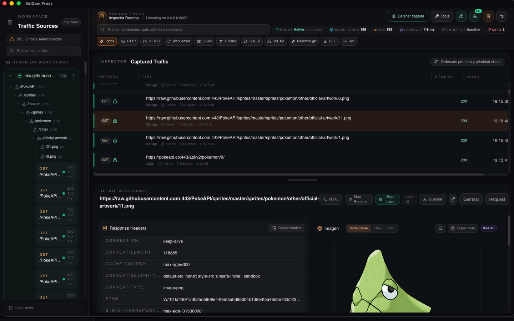
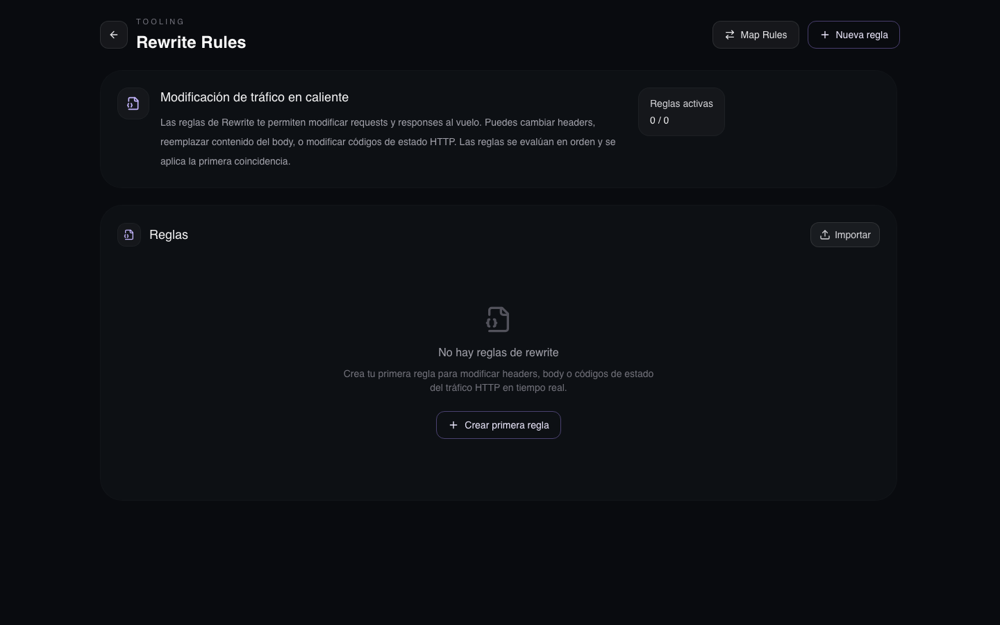
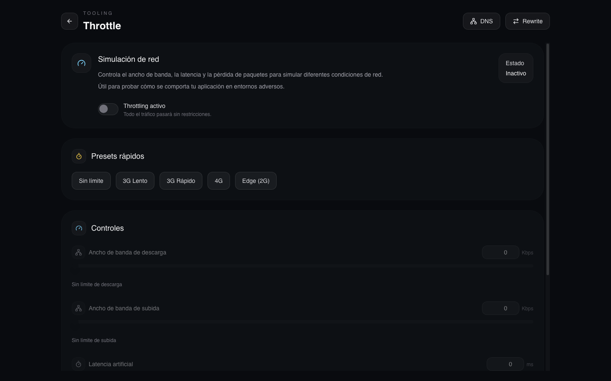
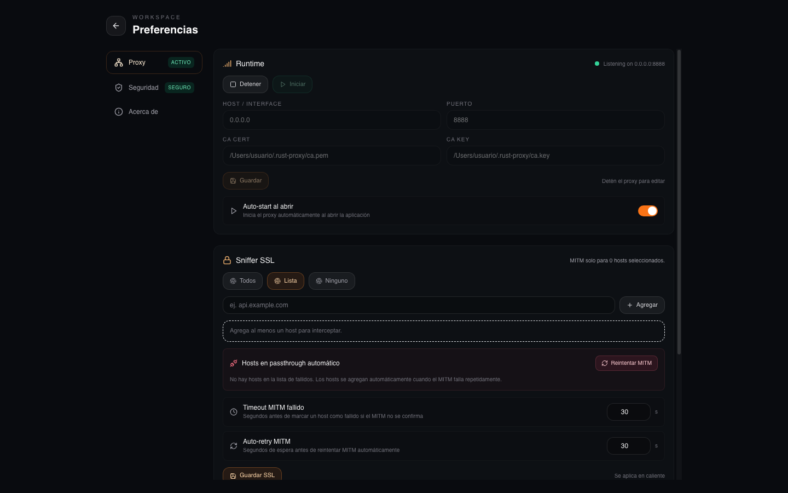

<p align="center">
  
</p>

<h1 align="center">ValDam Proxy</h1>

<p align="center">
  <strong>Proxy MITM profesional · Debugging HTTP/HTTPS · Simulación de redes · Automatización</strong>
</p>

<p align="center">
  <sub>Hecho en Rust · Interfaz nativa</sub>
</p>

<p align="center">
  <a href="https://paypal.me/rdvt?locale.x=es_XC&country.x=MX">
    
  </a>
</p>

---

## Tabla de contenidos

- [La historia detrás de ValDam Proxy](#-la-historia-detrás-de-valdam-proxy)
- [¿Qué es ValDam Proxy?](#-qué-es-valdam-proxy)
- [¿Para quién es?](#-para-quién-es)
- [¿Qué lo hace diferente?](#-qué-lo-hace-diferente)
- [Funcionalidades completas](#-funcionalidades-completas)
- [Capturas de pantalla](#-capturas-de-pantalla)
- [Especificaciones técnicas](#-especificaciones-técnicas)
- [Requisitos del sistema](#-requisitos-del-sistema)
- [Descarga e instalación](#-descarga-e-instalación)
- [Guía rápida: primeros pasos](#-guía-rápida-primeros-pasos)
- [Scripts incluidos](#-scripts-incluidos)
- [Precio y licencia](#-precio-y-licencia)
- [Donaciones](#-donaciones)
- [Comparativa con otras herramientas](#-comparativa-con-otras-herramientas)
- [Contacto](#-contacto)

---

## La historia detrás de ValDam Proxy

Llevo **varios años desarrollando ValDam Proxy**. Empezó como un proyecto personal — necesitaba una herramienta para debuggear APIs móviles y web, algo que me permitiera ver exactamente qué estaba pasando en cada petición HTTP.

Las herramientas existentes eran:
- **Charles Proxy** → Excelente pero licencia
- **Proxyman** → Bueno pero solo macOS y con limitaciones
- **mitmproxy** → Poderoso pero sin interfaz nativa, solo CLI/web

Ninguna me convencía del todo. Así que construí la mía.

Lo que empezó como un simple inspector de tráfico creció hasta convertirse en un **proxy MITM profesional** con rewriting dinámico, map local/remote, simulación de redes, scripting Python, breakpoints, reglas de bloqueo, throttling condicional, y mucho más.

Hoy, después de años de desarrollo, **ValDam Proxy versión v0.1.2** está disponible gratuitamente para toda la comunidad.

Si te ayuda en tu trabajo diario, considera apoyar el proyecto:

<p align="center">
  <a href="https://paypal.me/rdvt?locale.x=es_XC&country.x=MX">
    
  </a>
  <br>
  <sub>https://paypal.me/rdvt</sub>
</p>

<p align="center">
  <a href="https://valedam.lat">
https://valedam.lat
 </a>
</p>

---

## ¿Qué es ValDam Proxy?

**ValDam Proxy** es un proxy de interceptación **MITM (Man-in-the-Middle)** para HTTP/HTTPS, construido completamente en **Rust** con una **interfaz gráfica nativa** (Tauri + React).

Te permite:

- **Inspeccionar** cada petición y respuesta HTTP/HTTPS en tiempo real
- **Modificar** tráfico en tránsito con reglas automáticas
- **Redirigir** peticiones a servidores locales o remotos
- **Simular** condiciones de red adversas (3G, latencia, pérdida)
- **Automatizar** con scripts Python y Rhai
- **Guardar** tráfico en disco para auditoría
- **Bloquear** tráfico por dominio, URL o patrón
- **Editar y reenviar** peticiones modificadas
- **Configurar firewall** de Windows desde la UI

Todo desde una **interfaz moderna, rápida y nativa** que funciona en **macOS, Linux y Windows**.

---

## ¿Para quién es?

| Rol | Para qué le sirve |
|-----|-------------------|
| **Desarrollador backend** | Debuggear APIs, ver headers exactos, modificar respuestas |
| **Desarrollador mobile** | Probar apps en redes lentas, interceptar tráfico HTTPS |
| **QA / Tester** | Simular errores HTTP, crear mocks, automatizar pruebas |
| **DevOps / SRE** | Auditar tráfico, verificar redirecciones, testear DNS |
| **Security researcher** | Analizar tráfico cifrado, probar vulnerabilidades |
| **Estudiante** | Aprender cómo funciona HTTP/HTTPS, experimentar gratis |

---

## ¿Qué lo hace diferente?

| Característica | ValDam Proxy | Otros |
|----------------|-------------|-------|
| **Precio** | **Gratis** 🎉 | $12–$50 USD |
| **UI nativa** | ✅ Tauri (Rápida) | Swing/AppKit/Web |
| **Multi-plataforma** | ✅ macOS, Linux, Windows | Varía |
| **Pre-connect TLS test** | ✅ Con backoff y detección reactiva | ❌ No existe |
| **Python Scripts** | ✅ 15 ejemplos incluidos | ❌ No tienen |
| **Rhai Scripting** | ✅ Scripting integrado | ❌ No tienen |
| **Block Rules** | ✅ Condiciones AND + Status configurable | ❌ No tienen |
| **Throttle Rules (por URL)** | ✅ Condicional por patrón | ❌ No tienen |
| **Edit & Resend** | ✅ Editar y reenviar con live result | ❌ No tienen |
| **Firewall integration** | ✅ Windows Firewall desde la UI | ❌ No tienen |
| **Descompresión gzip/brotli/deflate** | ✅ Automática en todos los caminos | ❌ Parcial |
| **Pérdida de paquetes** | ✅ Configurable 0–100% | ❌ Raro |
| **Hot-reload** | ✅ Sin reiniciar el proxy | ❌ No tienen |
| **Tamaño** | ~13 MB | ~30–100 MB |

---

## Funcionalidades completas

### 1. Proxy HTTP/HTTPS con MITM
- Interceptación total con **hudsucker** + **rustls** (AWS-LC)
- **Lista blanca SSL**: control granular de hosts a interceptar
- **Certificado CA autogenerado** RSA 2048 bits (válido 10 años)
- **Portal web** para descarga del certificado
- **Pre-connect TLS test** con reintentos (backoff exponencial)
- **Detección reactiva**: hosts que fallan MITM → passthrough automático
- **Auto-retry**: cooldown configurable para reintentar MITM
- **Eventos MitmHostFailed** con razón específica (tcp_probe_failed, tcp_probe_timeout, mitm_stale_timeout)
- **Auto-start** configurable

### 2. Interfaz de escritorio nativa
- App nativa **~13 MB** (macOS, Linux, Windows)
- Dashboard en **tiempo real** con actualización vía eventos
- Sidebar colapsable con agrupación por host (pinned hosts)
- Panel de detalle con pestañas Request/Response
- **Vista JSON tree**: bodies como árbol expandible
- **Comando curl**: genera el curl equivalente para cualquier request
- Filtros rápidos y búsqueda de texto libre
- Tema oscuro con diseño moderno
- **Toast notifications**: sistema global de notificaciones
- **Edit & Resend modal**: editar y reenviar peticiones

### 3. Map Local / Map Remote
- **Map Local**: responde con archivos (fixtures, mocks, imágenes)
  - Editor JSON integrado (Ctrl+S, Ctrl+Z)
  - Diff viewer, vista previa de imágenes
  - Drag & drop desde el Finder
- **Map Remote**: redirige a otra URL
  - Preserva header `Host` original si se desea
  - Descompresión automática gzip/deflate/brotli
- Patrones **glob** con `*` y captura de segmentos (`$1`, `$2`)
- Test en vivo antes de guardar

### 4. Rewrite Rules
- Modificación automática de tráfico en tránsito
- **6 tipos de reemplazo**: HeaderValue, BodyContent, StatusCode, UrlModify, UrlHost, UrlQuery, UrlPath
- **Condiciones múltiples AND** (URL, Path, Host, Query, Header, Body, Status)
- **Soporte Regex** con flags y **Visual Regex Builder**
  - Anclas `^`/`$`, presets URL, tokens, grupos de captura
- **Preview en vivo**: prueba patrones en tiempo real
- **Filtro por método HTTP** (GET, POST, PUT, DELETE, etc.)
- **Descompresión automática**: los bodies comprimidos (gzip, br, deflate) se descomprimen **antes** de aplicar reglas

### 5. DNS Tools
- **Resolución DNS** de cualquier hostname
- **Mapeo DNS personalizado**: tipo `/etc/hosts` desde la UI
  - Asigna IPs fijas a hostnames
  - Hot-reload: se aplican sin reiniciar
- Historial con indicadores de tiempo

### 6. Throttle global (Simulación de red)
- Control granular en **vivo**:
  - Ancho de banda descarga/subida: 0–100 Mbps
  - Latencia: 0–5000 ms
  - **Pérdida de paquetes**: 0–100%
- **Presets rápidos**: 3G, 4G, Edge, Sin límite
- Dashboard en vivo: uptime, requests, bytes, pérdida

### 7. Throttle Rules (Reglas por patrón)
- Reglas de throttling **condicionales por URL**:
  - Condiciones AND (Url, Path, Host, Query, Header, Body, Status)
  - Configuración independiente por regla (ancho de banda, latencia, pérdida)
  - Presets rápidos en el editor
- **Test de URL en vivo**: prueba qué regla aplicaría
- **Primera coincidencia gana**: evaluación en orden de prioridad
- Toggle individual y búsqueda de reglas

### 8. Mirror (Guardar tráfico)
- Guarda requests/responses como archivos
- Organizado por `host/path/timestamp.ext`
- Extensiones inteligentes según Content-Type
- Límite de 5 MB por archivo
- Hot-reload mediante `ProxyCommand::SetMirror`

### 9. Breakpoints
- Pausa requests/responses en tiempo real
- Acciones: **Continue**, **Modify & Continue**, **Abort** (403)

### 10. Block Rules (Bloqueo de tráfico)
- Bloqueo de tráfico basado en condiciones AND:
  - Url, Path, Host, Query
- **Código de estado configurable**: 403, 404, 405, 500, 502, 503
- **Filtro por método HTTP**: GET, POST, PUT, DELETE, PATCH, HEAD, OPTIONS
- **Test de URL en vivo**: prueba una URL contra todas las reglas activas
- Persistencia y hot-reload

### 11. Python Scripts
- Adjunta scripts Python a URLs específicas
- Comunicación vía **stdin/stdout** (JSON)
- **4 combinaciones Phase × Mode**:
  - Request/Origin → genera response
  - Request/Filter → modifica request
  - Response/Filter → modifica response
- **15 scripts de ejemplo incluidos** (ver sección abajo)
- Timeout configurable por script

### 12. Rhai Scripts
- Scripting integrado con el lenguaje Rhai
- Controla throttle, breakpoints, mirror, bloqueo de dominios
- **6 scripts de ejemplo incluidos**

### 13. Descompresión automática
- **gzip**, **brotli** y **deflate** se descomprimen automáticamente
- Soporta valores compuestos como `gzip, br`
- Funciona en **todos los caminos** del proxy
- El cliente recibe el body descomprimido

### 14. Edit & Resend
- Edición completa de peticiones HTTP capturadas
- Modificar método, URL, host/puerto, headers, body
- **Formateo JSON** con pretty print
- **Resultado en vivo**: status code, body, tamaño
- Cada reenvío se agrega como nuevo item en la tabla de tráfico

### 15. Network Config / Firewall
- Gestión de reglas de firewall (Windows)
- Detección de estado del firewall (OK, sin regla, puerto bloqueado)
- Agregar regla de firewall desde la UI
- Detalles completos de la regla: perfil, acción, protocolo, puerto, programa

### 16. Settings (Preferencias)
- **Proxy**: runtime, host/puerto, Mirror, SSL sniffer, MITM failed hosts, logs
- **Seguridad**: estado del certificado, regeneración, portal de instalación
- **Acerca de**: versión, stack tecnológico, enlaces
- **Language**: selector Español/English
- **Timezone**: timestamps en hora local o UTC

---

## Capturas de pantalla

| Dashboard | Rewrite Rules | Throttle |
|---|---|---|
|  |  |  |

| Settings | | |
|---|---|---|
|  | | |

---

## Especificaciones técnicas

| Característica | Detalle |
|----------------|---------|
| **Versión** | v0.1.2 |
| **Motor MITM** | hudsucker + rustls (aws-lc-rs) |
| **Async runtime** | tokio |
| **HTTP** | hyper + http-body-util + reqwest |
| **Frontend** | React 18 + TypeScript + Tailwind CSS |
| **UI Framework** | Tauri 2.x |
| **State management** | Zustand |
| **Compresión** | flate2 (gzip, zlib, deflate) + brotli |
| **Scripting** | Rhai + Python (subprocesos) |
| **Certificados** | rcgen + native-tls |
| **Tamaño del binario** | ~13 MB |
| **Consumo de RAM** | ~50-150 MB en uso normal |
| **Puerto por defecto** | 8080 |
| **Límite de tráfico** | 10,000 requests en memoria (FIFO) |
| **Preview de body** | Hasta 2 MB por request/response |

---

## Requisitos del sistema

| Sistema | Requisito |
|---------|-----------|
| **macOS** | 10.15+ (Intel) / 11.0+ (Apple Silicon) |
| **Windows** | Windows 10+ (64-bit) |
| **Linux** | Ubuntu 20.04+, Fedora 38+, o similar |
| **RAM** | 512 MB mínimo / 2 GB recomendado |
| **Disco** | 100 MB libres |
| **Resolución** | 1280×820 mínima / 1680×1040 recomendada |

---

## Descarga e instalación

Puedes descargar los binarios precompilados desde la carpeta de distribución o desde la página de releases.

- **macOS (Apple Silicon)**: `release/ValDam Proxy_0.1.2_aarch64.dmg.zip`
- **macOS (Intel)**: `release/ValDam-Proxy-macos-latest.zip`
- **Linux (Ubuntu 22.04+)**: `release/ValDam-Proxy-ubuntu-22.04.zip`
- **Windows**: `release/ValDam-Proxy-windows-latest.zip`

Descomprime el archivo correspondiente a tu sistema operativo y ejecuta la aplicación.

Si en Mac OS te da problemas usa el comando:
```
xattr -cr "/Applications/ValDam Proxy.app"
```
Para eliminar los atributos del archivo

---

## Guía rápida: primeros pasos

### 1. Inicia el proxy
Abre la aplicación → haz clic en **▶ Iniciar**

### 2. Confía en el certificado CA
Settings → Seguridad → Portal de certificados → descarga e instala

### 3. Configura el proxy en tu sistema
Configura tu sistema operativo o navegador para usar el proxy HTTP/HTTPS en `127.0.0.1:8080`.

### 4. Navega
El tráfico aparece automáticamente en el dashboard

### 5. Explora
- Haz clic en cualquier request para ver detalle
- Prueba Rewrite Rules para modificar tráfico
- Activa Throttle para simular redes lentas
- Crea Block Rules para bloquear dominios no deseados
- Adjunta scripts Python para automatizar
- Usa Edit & Resend para modificar y reenviar peticiones

---

## Scripts incluidos

### Python Scripts (15 ejemplos)

| Script | Fase/Modo | ¿Qué hace? |
|--------|-----------|------------|
| `mock_api.py` | Request/Origin | Genera responses mock genéricas |
| `mock_con_retardo.py` | Request/Origin | Mock con latencia simulada |
| `mock_rest_api.py` | Request/Origin | Mock REST completo |
| `mock_graphql.py` | Request/Origin | Mock para GraphQL |
| `mock_servidor_archivos.py` | Request/Origin | Sirve archivos estáticos |
| `simular_errores_http.py` | Request/Origin | Simula errores HTTP (400-503) |
| `modify_request.py` | Request/Filter | Agrega headers y modifica body |
| `agregar_auth_header.py` | Request/Filter | Inyecta tokens de autenticación |
| `inyectar_sesion.py` | Request/Filter | Inyecta cookies y CSRF tokens |
| `redirigir_api.py` | Request/Filter | Redirige a otro entorno |
| `agregar_params_tracking.py` | Request/Filter | Agrega parámetros de tracking |
| `transformar_body.py` | Request/Filter | Transforma XML↔JSON |
| `modificar_json_response.py` | Response/Filter | Filtra campos en JSON responses |
| `strip_pii.py` | Response/Filter | Remueve campos PII (email, teléfono) |

### Rhai Scripts (6 ejemplos)

| Script | ¿Qué hace? |
|--------|------------|
| `simular-red-3g.rhai` | Simula red 3G (↓400Kbps, ↑100Kbps, 300ms latencia) |
| `restaurar-throttle.rhai` | Restaura throttling a valores por defecto |
| `throttle-con-escenario.rhai` | 7 perfiles de red diferentes |
| `analizar-rendimiento.rhai` | Prueba guiada 4G → 3G → Edge |
| `modo-depuracion.rhai` | Activa breakpoints + throttling suave |
| `bloquear-trackers.rhai` | Bloquea dominios de trackers |

---

## Precio

**ValDam Proxy es 100% gratuito.**

No hay versiones "Pro", ni features bloqueadas, ni licencias anuales, ni límites ocultos.

| Lo que obtienes | ValDam Proxy | Charles Proxy |
|----------------|-------------|---------------|
| Proxy MITM | ✅ Gratis | ✅ $50 USD |
| UI nativa | ✅ Gratis | ✅ Incluido |
| Rewrite Rules | ✅ Gratis | ✅ Incluido |
| Map Local/Remote | ✅ Gratis | ✅ Incluido |
| Block Rules | ✅ Gratis | ❌ No tiene |
| Throttle Rules (por URL) | ✅ Gratis | ❌ No tiene |
| Edit & Resend | ✅ Gratis | ❌ No tiene |
| Firewall integration | ✅ Gratis | ❌ No tiene |
| Python Scripts | ✅ Gratis | ❌ No tiene |
| Rhai Scripting | ✅ Gratis | ❌ No tiene |
| Descompresión gzip/brotli/deflate | ✅ Gratis | ❌ No tiene |
| Pérdida de paquetes | ✅ Gratis | ❌ No tiene |
| Hot-reload | ✅ Gratis | ❌ No tiene |
| **Precio** | **$0 USD** | **$50 USD/año** |

---

## ❤️ Donaciones

Si ValDam Proxy te es útil en tu trabajo diario, considera hacer una donación. Cada aporte ayuda a mantener el proyecto activo, agregar nuevas funcionalidades y mejorar la documentación.

<p align="center">
  <a href="https://paypal.me/rdvt?locale.x=es_XC&country.x=MX">
    
  </a>
</p>

<p align="center">
  <strong>PayPal:</strong> <a href="https://paypal.me/rdvt?locale.x=es_XC&country.x=MX">https://paypal.me/rdvt</a>
</p>

<p align="center">
  <sub>🇲🇽 Cuenta en México · Cualquier cantidad es bienvenida 🙏</sub>
</p>

---

## Comparativa completa

| Característica | ValDam Proxy | Charles Proxy | Proxyman | mitmproxy |
|---|---|---|---|---|
| **Versión** | **v0.1.2** | v5.x | v5.x | v10.x |
| **Precio** | **Gratis** | $50 USD | Gratis/Limitado | Gratis |
| **Lenguaje** | Rust | Java | Swift/ObjC | Python |
| **UI Nativa** | ✅ Tauri | ✅ Swing | ✅ AppKit | ❌ Web/CLI |
| **Tamaño** | ~13 MB | ~100 MB | ~30 MB | ~50 MB |
| **Multi-plataforma** | ✅ macOS/Linux/Win | ✅ macOS/Linux/Win | ❌ Solo macOS | ✅ macOS/Linux/Win |
| **MITM HTTPS** | ✅ hudsucker+rustls | ✅ | ✅ | ✅ |
| **Pre-connect TLS** | ✅ Con backoff | ❌ No | ❌ No | ❌ No |
| **Map Local** | ✅ Editor JSON+Diff | ✅ | ✅ | ✅ (map remote) |
| **Map Remote** | ✅ Preserve Host | ✅ | ✅ | ✅ |
| **Rewrite Rules** | ✅ AND+Regex Builder | ✅ | ✅ | ✅ |
| **Block Rules** | ✅ Condiciones AND+Status | ❌ No | ❌ No | ❌ No |
| **Throttle Rules (por URL)** | ✅ Condiciones AND+Presets | ❌ No | ❌ No | ❌ No |
| **DNS Mapping** | ✅ Historial+Resolver | ❌ No | ❌ No | ⚠️ Addon |
| **Throttling** | ✅ Dashboard en vivo | ✅ | ✅ | ✅ |
| **Pérdida paquetes** | ✅ Configurable | ❌ No | ❌ No | ❌ No |
| **Breakpoints** | ✅ Continue/Modify/Abort | ✅ | ✅ | ✅ |
| **Edit & Resend** | ✅ Live result | ❌ No | ❌ No | ⚠️ CLI |
| **Python Scripts** | ✅ 15 ejemplos | ❌ No | ❌ No | ⚠️ Addon |
| **Firewall integration** | ✅ Windows Firewall | ❌ No | ❌ No | ❌ No |
| **Exportación HAR** | ✅ Implementado | ✅ | ✅ | ✅ |
| **Hot-reload** | ✅ Sin reiniciar | ❌ No | ❌ No | ❌ No |
| **Portal de certificados** | ✅ Web incorporado | ❌ No | ❌ No | ❌ No |

---

## Contacto

| Canal | Enlace |
|-------|--------|
| **Donaciones** | [https://paypal.me/rdvt](https://paypal.me/rdvt?locale.x=es_XC&country.x=MX) |
| **Proyecto** | GitHub |
| **Documentación** | Carpeta `docs/` del repositorio |
| **Reportar bugs** | Issues en GitHub |
| **Sugerencias** | Issues en GitHub |

---

<p align="center">
  <sub>
    Hecho en Rust · v0.1.2 · Varios años de desarrollo<br>
    ValDam Proxy
  </sub>
</p>

<p align="center">
  <a href="https://paypal.me/rdvt?locale.x=es_XC&country.x=MX">
    
  </a>
</p>
